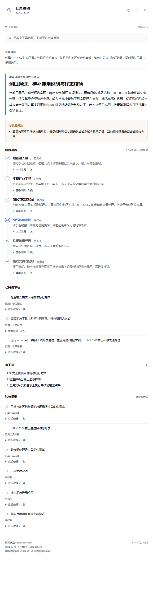

# TaskLens · 任务透镜

DSH 原生右侧栏插件，持续解释长程任务的目标、当前阶段、已完成事项、下一步与验收依据。



*示例使用合成任务记录。解释由 DSH 中配置的 DeepSeek 模型实际生成。*

## 功能

- **宏观阶段解释**：3—7 个阶段，显示进行中、已完成、待推进和受阻状态。
- **随会话切换**：每个会话独立保存解释、历史检查点与暂停状态。
- **配置模型复用**：默认跟随会话模型，也可从 DSH 已配置的模型列表选择解释模型。
- **过程验收**：完成事项显示“工具结果”“会话陈述”或“模型判断”，逐项展开来源记录；验收项区分已有工具依据、待核验和发现问题。
- **控制调用频率**：自动跳过静止记录，支持暂停、手动更新、调用上限和失败退避。

## 安装

已验证环境：DeepSeek Harness **0.2.0-rc.2** 桌面版。插件依赖 DSH 原生侧栏和模型服务。

在 DSH 的“插件”页面安装以下 GitHub 包：

```text
github:LeoAndJellyfish/dsh-tasklens#v0.1.0
```

使用 DSH 命令行也可安装：

```sh
dsh plugin --profile desktop add github:LeoAndJellyfish/dsh-tasklens#v0.1.0
```

发布页提供 `dsh-tasklens-0.1.0.tgz`，可通过插件安装入口选择本地包。更新已有版本后重启 DSH，加载新的宿主代码。仓库包含构建产物，安装时无需执行构建脚本。

## 使用

1. 打开一个 DSH 会话，展开右侧栏，在新标签页中选择 **任务透镜**。会话标题区也提供入口。
2. 开始任务后查看自动解释；历史会话可点击刷新按钮生成一份阶段解释。
3. 点击齿轮配置模型、频率和详略；暂停按钮控制当前会话的自动解释。
4. 展开“查看依据”核对来源，通过历史下拉框回看阶段变化。

首次打开历史会话不会自动生成已结束任务的解释；点击刷新后按当前记录生成。自动观察针对插件启用后的主会话事件，以及打开时仍在运行的会话。子代理的独立会话保持各自记录，主会话中的汇报与工具结果作为主任务的解释依据。

## 默认更新策略

| 情况 | 行为 |
| --- | --- |
| 新一轮任务开始 | 等待约 10 秒，收集初始行动 |
| 清单、目标、审批或交付变化；本轮结束 | 约 3 秒后优先检查，遵守调用最短间隔 |
| 持续执行 | 每 90 秒检查一次；新增记录触发解释 |
| 没有新增公开记录 | 跳过模型调用 |
| 自动调用最短间隔 | 30 秒，可设置 15—120 秒 |
| 每小时调用上限 | 全部会话合计 40 次，手动更新计入上限 |
| 同时生成 | 最多 2 个会话，每个会话保持单次调用 |
| 单次模型超时 | 90 秒 |
| 调用失败 | 指数退避，连续 3 次失败后停止自动解释 |

定时间隔可设置 45—600 秒。精简、标准、详细模式分别要求摘要约 120、300、600 字；阶段与验收项目单独列示。最终长度由模型输出决定。

页面每 5 秒读取本地状态；此操作无需调用模型。侧栏关闭后，正在观察的主任务仍按设置自动生成检查点。重启后恢复本地历史，运行中的会话在打开侧栏或产生新事件后继续观察。

## 来源与数据

解释模型读取用户需求、助手公开回复、工具调用和结果，以及任务清单、目标、审批、交付等公开记录。内部推理、系统提示、请求配置和供应商凭据从解释上下文中排除。常见凭据格式执行脱敏；会话中业务资料仍会发送至所选模型，敏感任务可选择已配置的本地模型或暂停解释。

每次提取最多 40 条记录，公开证据文本预算为 18,000 字符，另附原始需求、最新需求与上一份解释。上下文截断可能省略早期细节。每个会话保留最近 40 个检查点，包含解释及引用的来源摘录。

本地记录位于 `DSH_HOME/storages/dsh-tasklens`；未设置 `DSH_HOME` 时使用 `~/.dsh/storages/dsh-tasklens`。设置、调用计数和解释记录以 JSON 原子写入。会话标识经哈希用于文件命名。

解释通过独立模型请求生成，无工具执行权限，并保存在插件自己的存储中。主会话消息保持独立。本轮回复结束显示“本轮结束，待核验”；阶段进展采用有来源的记录，页面不展示推算的完成百分比或预计结束时间。

来源校验检查引用记录是否存在、是否含工具结果。具体结论仍由解释模型判断，来源展开用于人工核对测试范围和交付内容。

## 开发

```sh
npm ci
npm run check
npm pack
```

`check` 运行 TypeScript 检查、行为测试和构建。宿主入口为 `src/index.ts`，原生侧栏入口为 `src/client/index.tsx`，调度与存储逻辑为 `src/runtime.ts`。构建产物提交在 `lib/`，方便 GitHub 包安装。

实现与验证说明见 [设计说明](docs/design.md)。

## 许可证

[MIT](LICENSE)
