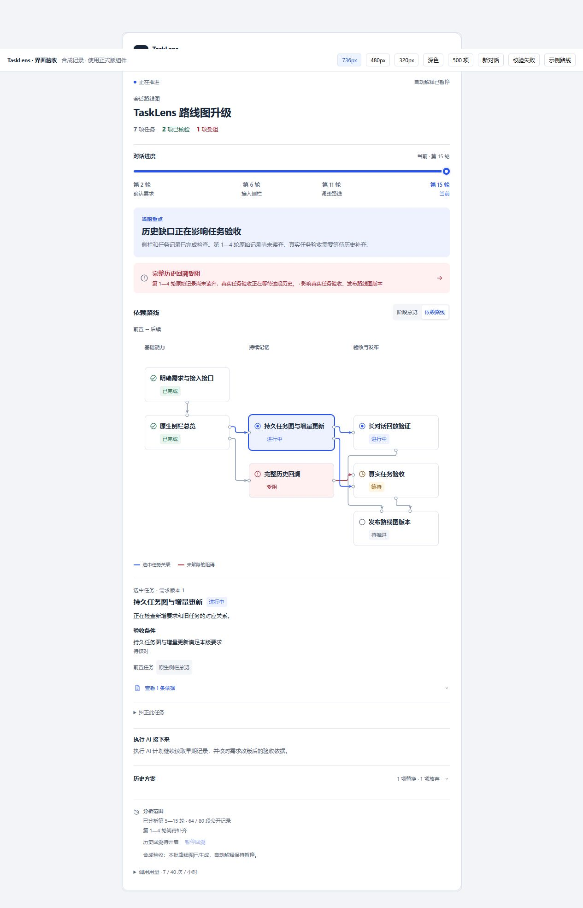
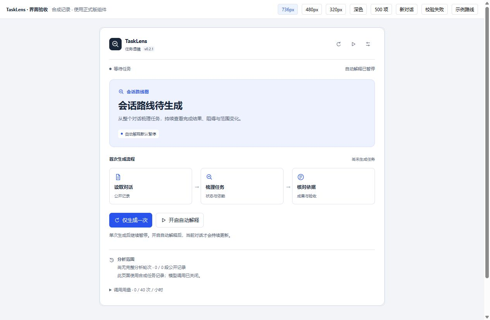

# TaskLens · 任务透镜

DSH 原生右侧栏插件。随对话维护任务路线，说明当前结果、阻碍、范围变化和验收依据。



*界面示例使用合成记录和正式版组件。*

## v0.2 功能

- **持续任务图**：任务拥有稳定标识，完成、等待、受阻、暂缓、放弃和替换均有独立状态；失败尝试与需求改版保留历史。
- **横向对话进度条**：选择历史切面，回看当时的任务、摘要与依据。
- **阶段总览与依赖路线**：重点结果、阻碍和用户待办分层展示；窄栏采用纵向布局，大图提供阶段入口与局部关系。
- **有依据的工作汇报**：区分检查结果、执行 AI 的完成报告、计划和用户确认。命令细节进入折叠区域。
- **用户纠正**：修改名称、状态、阶段、前置任务，或合并、拆分任务；纠正记录绑定当前需求版本。
- **按对话主动开启**：新对话默认暂停自动解释。打开侧栏、切换会话和新消息均不会启动模型调用。

### v0.2.1 更新

- **重新设计默认页**：版本标识、蓝色主卡片和横向生成流程；未生成任务时也有完整界面。单次生成按钮置于首位。
- **默认依赖路线**：阶段卡片按前置关系对齐，选择关联与持续阻碍采用独立颜色；保留用户主动选择的阶段总览。
- **生成失败修复**：无依据数字仅影响对应摘要，已通过校验的任务继续保存。同批重复任务合并来源与验收条件。
- **输出截断恢复**：仅接收完整且通过正常校验的任务操作，整批覆盖继续标记待分析。失败原因采用简明提示，可单次重试。



*默认页使用正式版组件，无模型调用与虚构任务。*

## 安装

已验证环境：DeepSeek Harness **0.2.0-rc.2** 桌面版。

DSH 插件页面可安装：

```text
github:LeoAndJellyfish/dsh-tasklens#v0.2.1
```

或使用命令行：

```sh
dsh plugin --profile desktop add github:LeoAndJellyfish/dsh-tasklens#v0.2.1
```

[发布页](https://github.com/LeoAndJellyfish/dsh-tasklens/releases/tag/v0.2.1)提供 `dsh-tasklens-0.2.1.tgz`。更新后重启 DSH，加载新宿主代码。仓库提交构建产物，安装无需运行构建脚本。

## 使用

1. 打开 DSH 会话，在右侧栏选择**任务透镜**；会话标题区也提供入口。
2. 点击**开启自动解释**后，当前对话开始持续更新。暂停状态按对话保存，重启后恢复。
3. 点击**仅生成一次**或顶部刷新按钮，单次处理一批公开记录，随后继续暂停。长历史可能需要多批读取；页面显示已分析与尚待补齐的范围。
4. 使用横向进度条查看历史；点击任务查看验收条件、失败尝试、原文依据与版本变化。
5. 齿轮中可选择 DSH 已配置的模型、阅读层级、调用频率和预算。全局自动解释开关仅允许已主动开启的对话运行。

v0.1 的解释原样保留在“旧版解释”。升级后，这些对话也默认暂停；用户开启或手动生成后，插件根据公开历史建立任务图。

## 调用与预算

以下自动策略在当前对话已开启时生效。

| 情况 | 行为 |
| --- | --- |
| 新对话、打开页面、会话切换 | 默认暂停，零自动模型调用 |
| 开启当前对话 | 约 1 秒后开始检查，遵守最短间隔 |
| 新一轮开始 | 约 10 秒后检查 |
| 需求、计划、审批、交付、本轮结束或明确检查结果变化 | 约 3 秒去抖 |
| 普通行动更新 | 默认 90 秒检查一次 |
| 没有新增公开记录 | 跳过模型调用 |
| 自动调用最短间隔 | 默认 30 秒，可设 15—120 秒 |
| 小时调用上限 | 默认 40 次，所有对话、手动生成、回溯与修复共用 |
| 输入预算 | 默认估算 8,000 tokens，可设 8,000—32,000 |
| 小时 token 预算 | 默认 400,000，调用前预留输入与最大输出 |
| 并发与超时 | 最多 2 个对话；每个对话单次调用；120 秒超时 |
| 失败 | 有限修复与指数退避；连续 3 次失败后停止自动解释 |

单次输出上限为 8,192 tokens；模型声明低推理档位时优先使用该档位。协议引导每次最多 20 项操作、3 个阶段、6 个具体任务和 4 项候选事实，后续分批补充。输出超限时，宿主校验完整操作并保留待分析队列。实际消耗受模型、公开记录和结构输出长度影响。预算包含失败调用。页面每 5 秒读取本地状态，此操作无模型调用。暂停会取消在途请求，供应商已经处理的请求可能产生用量。

摘要通常采用短标题与 2—3 句工作汇报，优先结果、影响和下一步。详略设置控制完整陈述的选择，模型长度仍存在差异。

## 长对话与数据

本地完整任务图与单次模型窗口独立保存。每批输入包含受保护的目标要求、相关节点与依赖、当前验收、近期尝试、分段记忆和新增公开记录。原文按片段排队读取，早期任务不会因模型本次省略而删除。

长历史先生成近期视图，再按序回溯；近期视图显示覆盖缺口。历史重建采用独立代次，完成后核对标识并重放用户纠正。暂停当前对话也会停止自动回溯。受保护要求超出输入预算时，涉及完成、撤回和需求改版的判断保持待核对；可提高预算。

完成状态需要当前版本的必需验收依据。机器核验要求公开计划或调用中的命令与产物绑定、相同调用的结果和明确退出码；明确的用户验收也可确认相应成果。无关文件读取与助手完成陈述保留待验收。自然语言对象匹配仍存在歧义，可展开原文并纠正任务。

解释模型读取用户消息、助手公开回复、工具调用与结果、任务清单、目标、审批及交付记录。内部推理、系统提示、请求配置和供应商凭据排除在输入之外；常见凭据格式执行脱敏。公开业务内容发送至用户选择的已配置模型。插件请求无工具权限，任务图保存在插件目录。

本地目录：`DSH_HOME/storages/dsh-tasklens`；默认 `~/.dsh/storages/dsh-tasklens`。包括设置、用量、按会话隔离的校验日志、恢复检查点、来源缓存与用户纠正。已解析响应被拒绝时，本地最多保留一份 160 KB 的诊断记录，包含公开来源和拒绝原因。历史没有 40 条截断。记录损坏时停止覆盖，并保留可恢复部分。

## 开发与验证

```sh
npm ci
npm run check
npm run preview
npm pack
```

`preview` 在 `http://127.0.0.1:19571` 提供合成界面验收环境，使用正式版 React 组件，关闭实际模型调用。

验证包含 TypeScript、生产构建、101 项行为测试、20 组固定事实表达案例、500 节点与 10,000 事件预算检查，以及 DSH 配置模型的六阶段合成对话。v0.2.1 另在本机长对话核对默认界面和单次路线图生成；自动解释保持暂停。表达案例用于回归检查；真实用户理解度研究尚未开展。

实现细节见[设计与验证](docs/design.md)。原架构、交互和语言设计保存在[设计文档](docs/plans/)。

## 许可证

[MIT](LICENSE)
