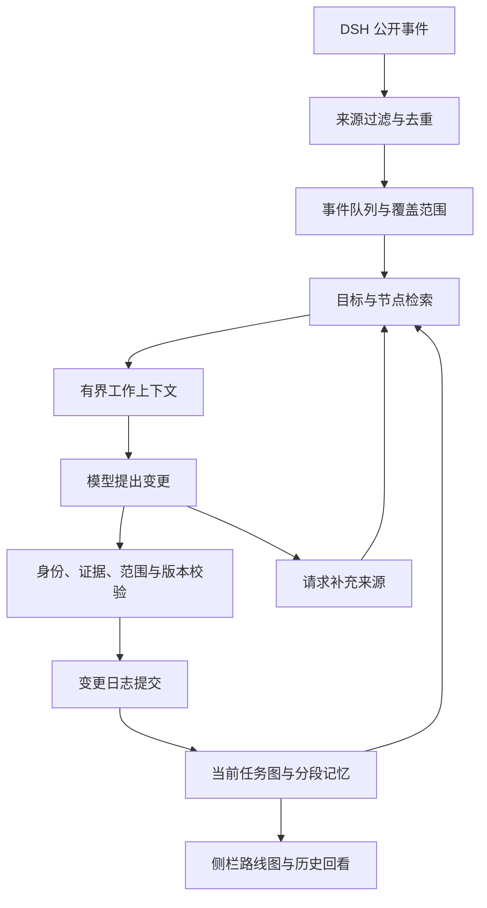

# TaskLens v0.2：持续路线图与上下文管理

日期：2026-10-07
状态：设计稿，待评审
范围：同一 DSH 会话及其主任务中可见的子任务汇报。独立主题使用独立目标分组；跨会话项目关联留作后续范围。

## 1. 现状与目标

当前版本保存检查点，每次依据最近的公开记录和上一份解释重新生成阶段列表。`src/core.ts` 从最近 160 条候选记录中选取最多 40 条证据；`src/runtime.ts` 向模型提供上一份 briefing；`src/briefing.ts` 每次解析最多 7 个阶段。阶段标识的延续依赖提示词，节点缺少独立存储、状态变更记录和依赖关系。早期承诺、被替换方案及长期未处理事项容易退出当前视图。

v0.2 的主要数据是持续保存的任务图。每次分析提交一组有来源的变更，解释文字依据已接受的变更生成。用户应能查看：

- 全部当前目标、计划中的工作和已有成果。
- 任务的完成、等待、受阻、暂缓、放弃和替换状态。
- 状态变化的时间、原因、证据及需求版本。
- 当前阻碍影响哪些后续工作。
- 从对话开始到当前的任一已分析历史视图。
- 已分析范围、尚待回溯范围和未决判断。

路线图采用公开记录。模型内部推理、系统提示和供应商配置沿用现有过滤边界。

## 2. 三种方案比较

| 方案 | 优点 | 代价与适用性 |
| --- | --- | --- |
| 每次读取全对话，重建路线图 | 原型简单，完整输入便于初次建图 | 长对话调用成本增长；节点匹配、旧状态保存和布局稳定仍需额外机制 |
| 上一份摘要 + 新记录，递归更新 | 输入规模较小，容易延续现有实现 | 多次压缩后承诺、取消原因和证据细节可能遗漏；纠错依赖回查原始记录 |
| 持久任务图 + 事实记录 + 按需检索 + 增量变更 | 节点和决策持续保存；更新范围可控；支持历史回放与来源校验 | 需要节点识别、变更验证、覆盖范围和重放机制 |

推荐第三种方案。全量读取用于首次回溯和修复；摘要用于浏览与检索；当前任务状态由结构化记录维护。

## 3. 任务图的数据结构

层级采用“目标 → 阶段 → 任务”。可验收成果对应任务节点；备选方案作为带有方案属性的任务节点。决策、证据、执行尝试与验收结果使用关联记录。

```text
Roadmap
  id, sessionId, schemaVersion, graphVersion
  goals[], nodes[], edges[], decisions[], unresolved[]
  observedCursor, analyzedIntervals[], rebuildGeneration

Goal
  id, title, scopeRevision, requirements[], constraints[]
  origin, sourceRefs[], active

Node
  id, goalId, parentId, kind, title, aliases[], displayOrder
  scopeRevision, scopeAuthority, status, reason
  acceptance[], blocker?, sourceRefs[], lastChangedAt
  replaces?, verificationValidity, annotations[]

SourceRef
  sessionId, seq, publicTextHash, span?, role, sourceValidity

Change
  id, batchId, baseGraphVersion, graphVersion, analyzedRange
  operation, nodeId, before, after, reason, sourceRefs[]
```

节点标识由宿主生成，名称修改沿用标识。新节点先使用模型输出的临时标识，验证后分配持久标识。节点合并保存旧标识的 alias；拆分保留原节点和拆分原因。模型省略某个节点时，该节点维持原状。

`scopeAuthority` 区分用户要求、已采纳计划和助手提出的拟议步骤。拟议步骤显示“拟议”，用户明确要求和已采纳计划形成当前工作范围。每条约束记录来源、适用目标、有效范围和替代关系。

关系类型保留三类：父子关系、前置依赖 `requires`、方案替换 `replaces`。父子关系和前置依赖各自检查循环；替换关系单独保存历史。

## 4. 状态与证据

| 状态 | 含义 | 状态依据 |
| --- | --- | --- |
| 待推进 `pending` | 当前范围内尚未开始的工作 | 用户需求或已采纳计划 |
| 进行中 `active` | 已开始执行，存在近期行动 | 对应任务的公开行动 |
| 等待 `waiting` | 等待输入、授权、外部结果或前置任务 | 明确的等待对象及解除条件 |
| 受阻 `blocked` | 已知问题阻止继续推进 | 未解除的问题、影响和解决条件 |
| 待验收 `review` | 已提出完成结论，核验记录尚待补齐 | 完成陈述、部分检查或未绑定版本的结果 |
| 已完成 `done` | 当前需求版本的必需验收项均有核验记录 | 相关机器检查结果或用户确认 |
| 暂缓 `paused` | 工作暂时停止，继续条件仍保留 | 用户暂缓、执行中断或明确暂停计划 |
| 已放弃 `abandoned` | 此项工作已从当前范围撤回 | 具有范围调整权限的明确指示 |
| 已替换 `superseded` | 当前方案已有替代方案 | 替换决定、原因和新节点关联 |

任务状态、执行尝试与验收状态分别保存。例如，首次测试失败但后续修复通过，任务可继续进行或完成；失败尝试仍保留在历史中。一次工具错误先产生尝试记录。任务进入受阻状态需要明确持续阻碍。

完成判断需要检查来源内容、验收范围和成果版本。当前版本“引用了工具结果即可显示 passed”的规则升级为逐项验收：

1. 验收项从用户需求及采纳计划建立，变更时增加需求版本。
2. 模型提出结果与验收项的对应关系。
3. 宿主校验来源身份、记录有效性、明确的结果、范围和版本绑定。
4. 每项记录 `passed / failed / unknown`，附核验方式和来源。
5. 必需项均已通过时进入已完成；范围或版本绑定尚待确定时保持待验收。

验收记录区分机器核验、模型判断和用户确认。机器核验采用已注册的结果解析规则，并匹配工具调用、验收项及成果版本；例如测试退出码、具体用例和被测试的提交标识。自然语言的相关性映射标注为模型判断。缺少可核验的对应关系时保持待验收，用户可查看原文并确认或纠正。

文章、设计稿等成果可记录交付及内容检查，用户确认形成验收依据。助手的“全部完成”陈述记录为完成声明。时间静止记录为“最近无新增行动”。对话中断记录为暂停或中断。

用户明确要求的成果撤回需要用户来源。助手可以撤回自己提出且尚未采纳的备选步骤；对于已有用户要求，助手的撤回陈述产生待判定记录。最新用户指示按目标和适用范围覆盖先前指示，保留覆盖原因与旧版本。

父阶段的完成按当前版本必需子项和自身验收项计算。放弃项、被替换项显示在历史分支中，其来源说明当前范围如何调整。界面优先显示状态数量及验收范围，省略推算百分比。

## 5. 四层上下文

| 层 | 保存内容 | 使用方式 |
| --- | --- | --- |
| 原始来源层 | DSH 会话原始记录及来源指针 | 查看原文、回溯、修订追踪和重建 |
| 持久事实层 | 目标、约束、节点、依赖、决定、验收、状态变化 | 当前路线图的长期记录；完整保存在本地 |
| 分段记忆层 | 按任务和连续记录范围形成的进展摘要、别名、关键词 | 检索入口；摘要附原文范围和节点标识 |
| 本次工作上下文 | 当前目标约束、受影响节点、新记录、相关旧证据 | 每次模型分析的有界输入 |

以下内容持续保留在事实层：未满足要求、未解除阻碍、用户确认、范围撤回、替换原因、验收标准和用户标注。文字说明可压缩，事实、状态、关系和来源指针持续保存。

分段摘要由对应原始公开记录和已接受变更生成。摘要修订可以回读该段原文，避免连续依赖此前摘要。来源已失效的摘要标记失效并重新生成。模型根据摘要提出状态修改时，宿主回查状态依据的原始证据。

## 6. 每次调用怎样选择上下文

先在完整本地索引中定位此次涉及的目标和节点，再组装输入：

1. 当前适用的目标、验收标准、用户约束和未决决定。
2. 整体路线图的精简索引：活动目标、节点标识、标题、状态和关系。
3. 本次受影响节点及其父节点、直接前置依赖的详细记录。
4. 尚未处理的新增公开记录。
5. 与新记录有关的历史决定、核验结果及原文摘录。

历史检索先匹配节点标识、成果路径、工具调用关联、目标标签和名称别名，再匹配关键词及时间指示。“最初方案”“恢复此前放弃的步骤”等表达触发目标起点或撤回记录的回查。DSH 全文搜索用于获取候选记录标识，进入模型的内容重新经过公开字段过滤和脱敏。

初版复用 DSH 搜索与本地标题、别名、成果标识索引。语义向量索引作为后续可选增强，评估依据是同义改写的漏检率。

候选映射存在歧义时，模型返回 `needsContext`，列出节点标识、来源范围或检索词。宿主进行一次有界补充读取，再提交分析。歧义仍存在时保存待判定事项，涉及的破坏性状态修改暂停应用。

### 输入预算示例

预算随所选模型窗口调整。以 8,000 tokens 的目标输入预算为例：

| 内容 | 初始配额 |
| --- | ---: |
| 协议与状态规则 | 600 |
| 适用目标、用户约束和验收标准 | 1,200 |
| 路线图精简索引 | 600 |
| 受影响节点及依赖详情 | 1,800 |
| 新增公开记录 | 2,200 |
| 历史证据与分段记忆 | 1,000 |
| 预算余量 | 600 |

这些数值是初始设计参数，需依据回放测试和实际模型表现调整。处理次序优先保留用户约束、验收标准、当前阻碍和更新所需来源；其次保留新记录；旧任务的叙述摘要按相关性分配剩余空间。

宿主读取模型的真实窗口元数据，预留输出与安全余量后确定输入上限。可用计数器存在时执行 token 检查；否则采用保守字符估算，并显示预算属于估算。输入超过预算时拆小事件批次。大任务图按目标分页装入，未装入的节点持续保存在本地且维持原状。

适用目标的受保护约束自身超过单次预算时，按验收项拆分分析，每批同时载入全局约束和该项约束。跨验收项的冲突另行汇总复核；该复核完成前，涉及的完成与撤回操作保持待判定。受保护记录持续存储，预算分配记录此次载入的范围与遗漏项。

全局约束自身超出窗口时，待提交变更逐组接受约束核验，各组结果共同形成提交依据。约束覆盖完整、判断一致后才提交；预算耗尽或存在冲突时保存待判定记录及尚待核验的分组，续接时继续处理。

早期约束进入适用目标的受保护记录。例如，第 3 轮要求离线运行，之后 100 轮讨论界面，后续涉及模型调用的分析仍载入该约束及其来源。一个无关目标的样式更新则读取自己的适用约束。

## 7. 增量分析与提交协议



模型输出变更操作：`add_goal`、`add_node`、`update_node`、`link_dependency`、`record_decision`、`record_verification`、`replace_node`、`merge_nodes`、`split_node`。范围撤回使用状态更新及范围版本变更。常规协议保留节点；彻底清除由用户的数据管理操作处理。

```json
{
  "baseGraphVersion": 27,
  "analyzedRange": {"fromSeq": 401, "toSeq": 428},
  "operations": [
    {
      "type": "update_node",
      "nodeId": "task-18",
      "expectedNodeRevision": 3,
      "changes": {"status": "paused"},
      "reason": "用户要求暂缓 PDF 导出，继续 HTML 交付",
      "sourceRefs": [{"sessionId": "example", "seq": 416}]
    }
  ],
  "needsContext": [],
  "unresolved": []
}
```

宿主按以下条件验证：

- 修改的节点已在此次上下文中载入，标识和预期版本一致。
- 新增关系指向已知节点，父子关系和依赖关系满足图约束。
- 来源编号、角色、文本校验值、消息有效性与此次观察切面一致。
- 完成、放弃、替换、范围修改满足对应的证据和权限规则。
- 变更与当前用户标注的字段锁一致。
- 批次和操作标识未提交过，写入保持幂等。

一组关联操作以事务方式接受。校验失败时保留最近的有效图、记录失败原因，允许一次有界修复。新事件在分析期间进入后续队列。新用户指示影响当前分析时，相关结果重新校对后再应用；视图始终标注分析截止位置。

模型返回的说明文字与已接受操作对应。部分操作被否决时，界面显示宿主根据已接受变化生成的简要说明，避免展示被否决的结论。

## 8. 覆盖范围与完整历史

分别维护已观察位置和已分析范围。读取到事件、过滤为公开记录、语义分析成功、变更提交完成是不同步骤。模型失败和预算耗尽时，已分析位置维持在最近成功提交的批次。

新会话从起点顺序处理。已有长会话采用近期预览与历史回填：

1. 读取完整日志的公开记录索引并计算分段范围。
2. 先生成近期预览，显示确切覆盖范围。
3. 后台从对话起点按序建立目标、约束、节点和决策。
4. 当前分支继续接收新事件，历史回填使用独立重建图和 generation。
5. 历史重建追上当前来源位置后，按来源和节点别名匹配预览节点，重放预览期间新增事件及用户标注。
6. 验证后原子切换为完整图；身份匹配存在歧义的节点保留候选关系。

历史回填和实时更新共用调用预算，实时更新优先。用户可暂停回填和查看剩余批次。回填期间显示“已分析第 1—20 轮与第 88—92 轮；第 21—87 轮正在回溯”，避免将局部视图呈现为完整历史。

每批公开记录都需要分析结果，或者明确记录该事件属于无图变更的资料。大工具输出保存截断标识和回读指针；缺失的验收细节保持待核验。

消息修订借助 DSH `traceEvent` 识别替换链，失效来源关联的事实、验收结果和摘要进入复核队列。分叉会话从继承记录重建当时视图，之后维护独立版本。主会话优先读取子代理的任务分配与结果汇报，原始子日志按证据缺口回查。

## 9. 更新频率与成本控制

实时状态和语义解释采用不同节奏：

| 触发 | 行为 |
| --- | --- |
| 工具开始、返回、审批等待或执行中断 | 立即更新对应执行尝试或运行提示；关联明确时更新临时状态 |
| 用户更改目标、明确撤回、采纳方案、关键验收结果 | 约 3 秒去抖后优先分析，自动调用最短间隔 30 秒 |
| 一般连续行动 | 每 90 秒合并检查一次 |
| 队列达到约 2,000 tokens 的公开新增内容 | 排队分批分析，遵守最短间隔与调用上限 |
| 无公开变化且无回溯队列 | 跳过模型调用 |
| 节点成为完成候选，或出现证据冲突 | 同批次优先载入验收与相关旧证据；不足时进行一次补充调用 |
| 用户查看历史、展开来源、改变布局 | 读取本地记录，无需调用解释模型 |

初始保留全局每小时 40 次、最多 2 个会话并发、每个会话单次分析。回填、补充读取后的分析、修复和手动分析均占用相同预算。每次分析最多一次补充和一次修复；超出后保存未决事项，避免循环调用。

增加滚动 token 预算配置及输入、输出计数，页面显示近期实际用量。次数限制与 token 限制共同控制消耗。参数作为可调默认值，通过长对话回放评估延迟、遗漏率和成本。

## 10. 侧栏与可视化

前端依据用户反馈修订，交互与视觉规格见[路线图前端修订](2026-10-07-roadmap-frontend-design.md)。对话历史采用横向进度条，当前重点与阻碍优先显示，任务详情按需展开；依赖图使用明确端口和避障走线。

默认布局采用阶段树，适配窄侧栏。目标作为分组标题，阶段下折叠子任务。当前活动、受阻和等待节点突出；完成与历史分支保留位置并可折叠。用户切换主题时，旧目标保留在已结束或暂缓目标组中。

页面顺序：

1. 当前目标和本次变化摘要。
2. 分阶段的任务树，显示状态与核验标签。
3. 当前阻碍及受影响的后续任务。
4. 已放弃、被替换的历史分支。
5. 历史版本和分析覆盖范围。

节点展开显示状态理由、验收标准、来源摘录、状态变化记录和依赖。被替换节点提供新方案链接；放弃节点保留原要求、撤回人及撤回理由。状态颜色配合文字及形状显示。

依赖图作为扩展布局，适合展开右侧栏查看并行任务及关键阻碍。它与阶段树读取同一任务图。默认沿既有阶段顺序布局，新增任务局部插入；既有节点标识和用户选择维持稳定。

历史版本选择读取当时的图，不调用模型，也不修改当前图。当前版支持用户纠正节点名称、状态、关系和重复节点。纠正记录包含作者、适用字段、需求版本和原因。标注锁作用于对应版本；新需求形成新版本，旧确认继续保留在旧版本历史中。新证据与当前标注冲突时显示未决标识，供用户处理。

完整来源和技术细节放入展开面板，主视图使用任务语言。缺少旧来源时直接显示该范围的核验缺口。

## 11. 存储、恢复与迁移

延续本地存储，按会话哈希建立目录：

```text
storages/dsh-tasklens/roadmaps/<session-hash>/
  head.json                 当前已提交版本、来源切面与覆盖范围
  checkpoints/<version>.json
  changes/<segment>.jsonl   已接受的变更与必要校验值
  facts/<segment>.json      事实与来源索引
  episodes/<segment>.json   分段记忆及来源范围
  annotations.json          用户纠正与字段锁
  pending.json              待分析范围、待判定与重建状态
```

单会话写入串行化，跨进程写入使用会话锁。先持久保存带校验值的变更段，随后原子切换 head。崩溃后从最近有效检查点重放完整提交，未完成的提交尾部进入恢复记录。每 20 次语义提交产生检查点，历史片段可按用户设置压缩归档。记录删除需要显式数据管理操作。

原始日志仍由 DSH 管理。插件保存来源指针、必要的已脱敏摘录和结构化事实。旧来源移除后保留当时记录与来源失效标记，历史说明仍可查看，重新核验显示缺口。

v0.1 的 40 个检查点用于近期预览和节点匹配提示。完整路线图从 DSH 原始公开历史重建，复核旧状态依据。迁移使用新的 schema 与目录，完成回填前保留旧视图入口。

## 12. 非功能目标与失败处理

以下为待实现与测量的目标：

- 已载入图的布局切换和节点展开在 200ms 内响应；长列表采用按需展开与虚拟渲染。
- 10,000 个公开事件、500 个节点的回放仍遵守单次输入预算，历史数据按段读取。
- 图更新校验、事件入队和持久写入在主 Agent 事件回调之外运行。
- 暂停、模型错误、超时、预算耗尽或重启后保留最近有效路线图与未处理队列。
- 未决语义判断局部标记，已知且有来源的其他进展继续显示。
- 公开记录过滤、敏感格式脱敏、RPC 身份验证和无工具的独立模型调用沿用现有边界。
- 来源正文作为数据处理；来源角色从 DSH 事件类型与元数据获取。

| 失败 | 处理 |
| --- | --- |
| 模型省略旧任务 | 旧节点保持原状 |
| 无效操作、虚构编号或越权撤回 | 拒绝相关事务，保存诊断与未决事项 |
| 模型超时或限额 | 保留当前图，队列退避，覆盖范围停止推进 |
| 节点匹配歧义 | 回查原文；继续歧义时保留候选关系 |
| 原始消息被修订 | 来源失效，关联事实和状态局部复核 |
| 存储中断 | 校验日志与 head，从最近有效提交恢复 |
| 回填与用户纠正同时发生 | 依据 graphVersion 与 annotationVersion 合并，冲突显式保留 |
| 切换解释模型 | 沿用持久节点和规范，记录本批使用的模型，执行相同校验 |

## 13. 关键决策记录（拟采纳）

| ADR | 决策 | 理由与代价 |
| --- | --- | --- |
| R01 | 持久任务图为主数据，模型提交增量操作 | 保留旧任务与状态历史；增加变更协议和校验成本 |
| R02 | 来源、事实、分段记忆、工作上下文分层 | 原文可回查，输入保持有界；需维护来源有效性和索引 |
| R03 | 状态、执行尝试和验收分别记录 | 反映重试、报告性完成与当前核验范围；需要更明确的验收模型 |
| R04 | 阶段树为默认布局，依赖图为扩展布局 | 窄栏易读，复杂关系按需展示；需要两种布局共享同一选择状态 |
| R05 | 初版采用分段文件、日志和检查点 | 延续现有安装方式，避免新增原生依赖；事务恢复与索引需自行实现 |
| R06 | 复用 DSH 搜索及本地关键词索引 | 复用配置，减少额外模型和索引服务；同义表达需回查兜底与召回测试 |
| R07 | 历史回填独立建图后原子切换 | 显示期间保持一致版本；需要标识匹配和用户纠正重放 |

SQLite 可作为后续存储选项，评估其事务与检索收益、打包兼容性和迁移成本；采用条件是分段文件的恢复或查询复杂度已成为实际瓶颈。当前设计围绕单用户桌面插件展开。

## 14. 实施顺序与验收

第一阶段：节点、状态、来源、变更日志和提交校验；替换当前整份 briefing 的状态维护方式。第二阶段：受保护目标与约束、分段记忆、检索和有界输入；建立长对话回放数据集。第三阶段：阶段树、来源展开、历史版本、放弃与替换分支，以及用户纠正。第四阶段：已有会话回填、修订复核、依赖图和迁移。

关键回放用例：

| 用例 | 预期结果 |
| --- | --- |
| 第 3 轮要求离线，后续 100 轮讨论界面 | 模型调用相关分析仍读取离线约束；相关旧任务和约束保留 |
| 第 10 轮放弃方案，后续 60 轮持续执行其他任务 | 放弃节点、来源和原因可查看 |
| 用户要求暂停 PDF，继续 HTML | PDF 暂缓、HTML 继续，沿用对应节点标识 |
| 用户撤回 PDF，改为网页交付 | PDF 撤回来源保留，网页任务和范围版本新增 |
| 助手自行取消用户要求的 PDF | 产生待判定记录，用户要求仍保留 |
| 助手宣称完成，工具验证无关事项 | 当前任务保持待验收 |
| 测试失败后修复，再验证通过 | 失败尝试保留，当前状态按相关新验证更新 |
| 验收后用户扩大要求 | 新需求版本进入复核，旧完成历史保留 |
| 标题不同、目标相同；标题相同、目标不同 | 前者可沿用别名；后者分别保存 |
| 产生新增记录或用户标注时，旧模型响应返回 | 版本校验和来源切面保持一致，相关冲突进入复核 |
| 模型返回缺来源的完成或放弃操作 | 操作被拒绝，旧图保持有效 |
| 反复读取、重试、崩溃或重启 | 变更幂等，队列和覆盖范围可恢复 |
| 历史回填尚未完成 | 显示已分析区间及缺口，用户可暂停与续接 |
| 原始消息被修订 | 关联证据失效，受影响节点重新核验 |
| 10,000 事件与 500 节点 | 每次输入遵守配置预算，未载入的旧节点保留 |

设计评估指标：需求与撤回事实的保留率、错误完成与错误放弃的数量、节点重复率、节点身份稳定性、历史覆盖完整性、每次输入与输出规模、更新延迟和用户纠正次数。初版以受控回放用例全部满足预期作为发布门槛，真实会话用于进一步验证模型差异与语义边界。

## 15. 参考依据

[Anthropic 的上下文工程实践](https://www.anthropic.com/engineering/effective-context-engineering-for-ai-agents)讨论了按需读取资料和持久结构化笔记对长程任务的作用，也指出压缩时会发生重要细节损失。这支持本设计中“结构化事实保留、摘要用于索引、原文按需回查”的选择；具体协议和预算来自本插件的需求分析。

[Lost in the Middle](https://arxiv.org/abs/2307.03172)在其测试任务和模型上观察到长上下文中信息位置影响使用效果。本设计据此安排早期约束回查与不同位置的回放测试；本插件的效果以实际模型验收为准。

DSH 接入能力核对了本地 0.2.0-rc.2 的 `SessionQueryEngine` 类型定义：`observeSession` 提供一致观察切面；`searchEvents`、`filterEvents`、`readEvent` 和 `traceEvent` 支持搜索、记录窗口及修订关系。公开内容仍需经过插件自己的字段过滤。
